# Deployment to OpenShift

Fork the following repositories before the demo 

1) Code Repo : https://github.com/redhat-na-ssa/azure-pipeline-demo-react-app
2) Manifest Repo : https://github.com/redhat-na-ssa/azure-pipeline-demo-react-app-gitops

## Prerequisite
### Create an Azure Org (https://dev.azure.com/)
   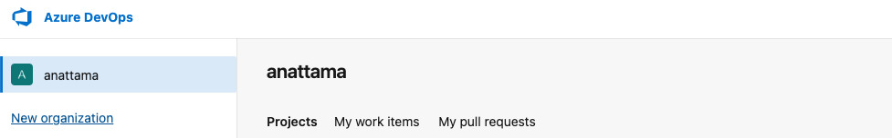
### Create an Azure Project
   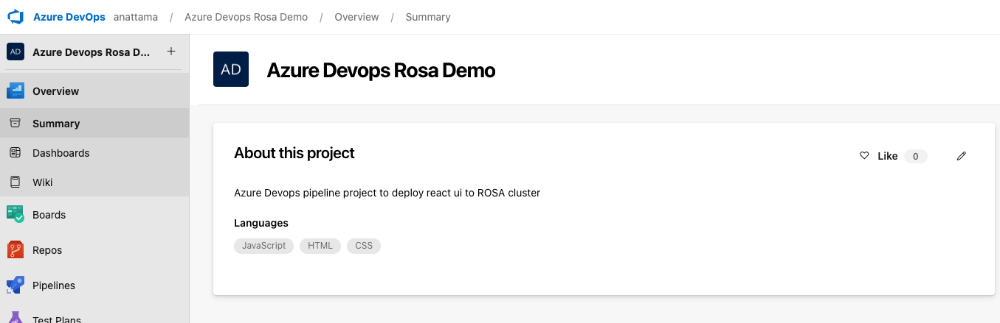

## Imperative Deployment

### Create Pipeline point to the git repository
   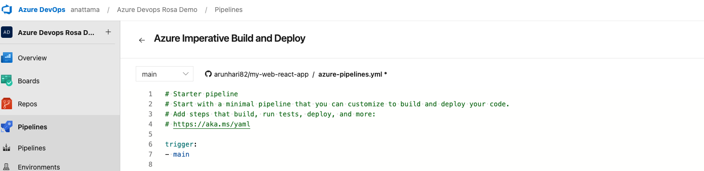
### Look for OpenShift extension provided by Red Hat
   
### Install OpenShift Extension
   
### Create Service Connection under Project Settings
   1) Provide Server URL ( OpenShift API server url)
   2) Provide Token for API Token
    
   ### Note the service connection name should match the name in the pipeline
   

### Run Pipeline
   
   Pipeline will use Imperative commands to deploy the react webapp to OpenShift.
   

## Gitops Deployment.
This section describes how to use Azure Pipelines for CI and OpenShift Gitops (ArgoCD) as CD 

Please refer to this pipeline  `azure-pipelines-with-gitops.yml`

### Logical Flow : 
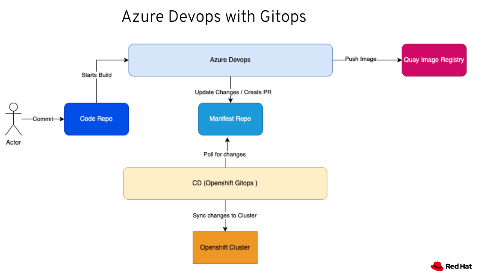


### Quay Setup 

To push the image from Azure Devops to Quay we need to enable robot account with appropriate privileges

#### Create a robot account for Azure pipeline
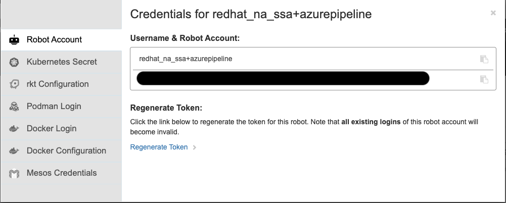

#### Create a new team under org
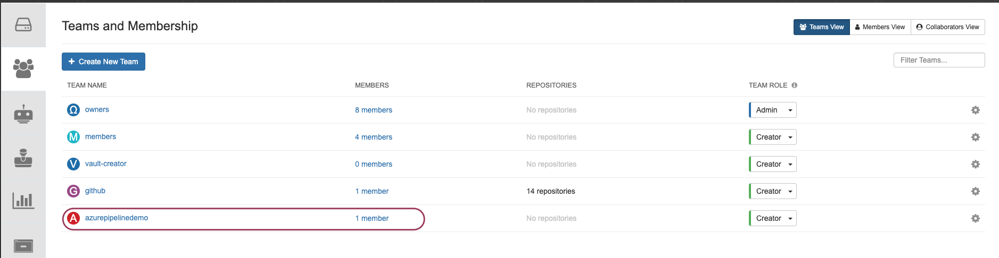

#### Add robot account under the team
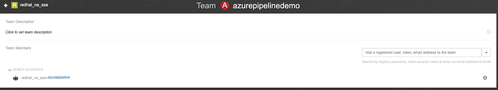


### Setup Service Connection for Azure to Quay

Under Project settings in Azure project => Service Connections => Select Docker Registry 

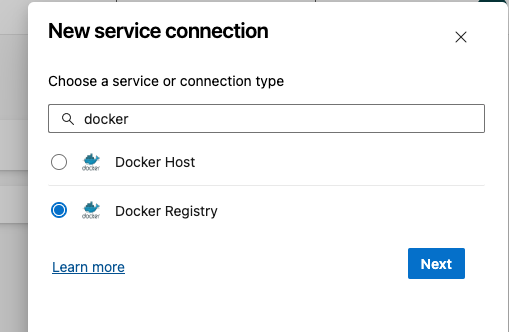

Provide all the details for Quay registry as shown below

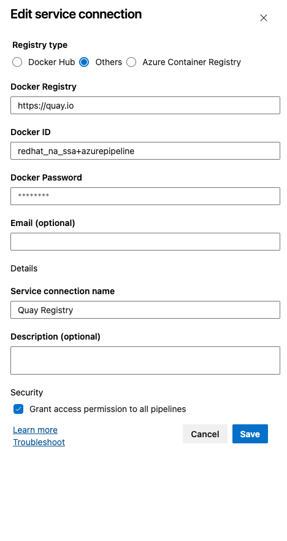

### Permission of gitops repositories 

Azure Pipelines needs permission to update the manifest repo. To achieve this 

1) Settings under Manifest repo.

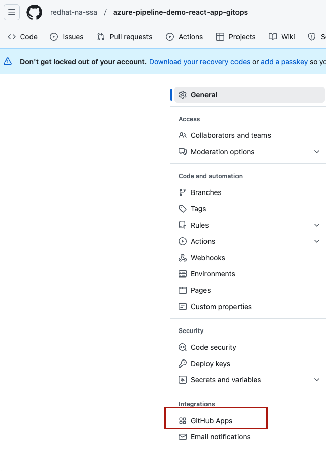

2) Configure Azure Application

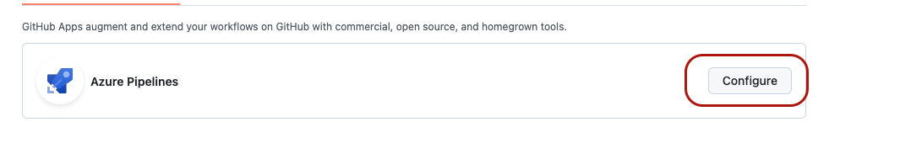

3) Select the Manifest repository to provide

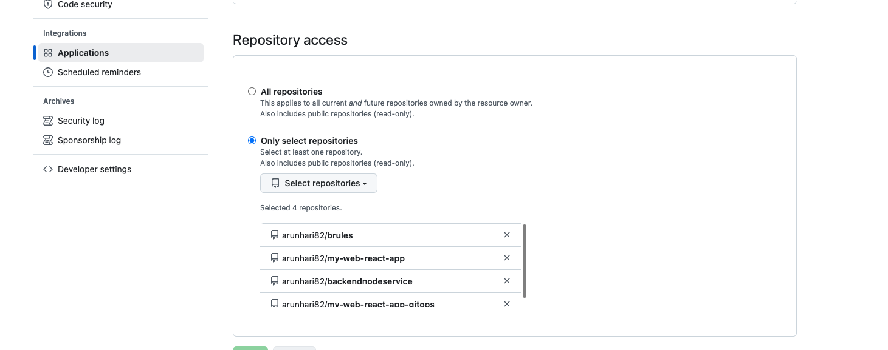

### Run Pipeline
   Execute the pipeline azure-pipeline-with-gitops.yaml from Azure.


# Custom Pool Agents on OpenShift

Instead of using Azure Ubuntu agents to execute the pipeline we can have self hosted agents to reduce cost. These self hosted agents can be deployed on OpenShift. The following section explains how to acheive that.

### Logical Flow


### Create an PAT (Personal Access Token)


Scope Required : Deployment Groups ( Read and Manage )
Store the token it needs to be reused to create the secret.

### Deploying the OpenShift Agent

Run the following commands to setup the prerequiste before deploying the agent.

```
    oc new-project azure-build

    oc create sa azure-build-sa

    oc adm policy add-scc-to-user anyuid -z azure-build-sa

    oc create secret generic azdevops \
    --from-literal=AZP_URL=https://dev.azure.com/<<YOUR ORG>> \
    --from-literal=AZP_TOKEN=<<YOUR PERSONAL ACCESS TOKEN>> \
    --from-literal=AZP_POOL="openshift Agent Pool"
```

Deploy the agent 
```
    oc create -f ./assets/resources/deployment.yaml 
```    

### Changes to Pipeline to use the agents
Update the pool to the agent pool name in `azure-pipeline.yaml`


### Verifying the agents
Under Agent pool list the agents under the agents tab like shown below. This should list the pod names from OpenShift in Azure.


If multiple pods are running under the deployment created all the pods should show here.


